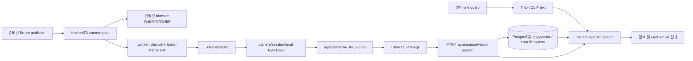

# Gods Watching 아키텍처 인계 문서

## 문서 상태와 용도

이 문서는 구현된 시스템의 아키텍처 계약과 아직 남은 검증 경계를 함께 설명한다. 운영 절차는 루트 `README.md`, 완료된 작업과 미충족 gate는 `docs/remaining-work.md`, 개별 실행 결과는 verification evidence를 기준으로 한다. 이 문서의 목표값을 적었다는 사실만으로 성능·품질 gate가 통과한 것은 아니다.

Task 1–14, 16, 18, 19의 구현과 해당 task-level acceptance가 현재 작업 트리에 존재한다. 루트 Compose, Caddy, PostgreSQL/Alembic, MediaMTX, Triton, API, worker, React 앱, crop 저장 및 verification harness가 설치되어 있다. Task 15, 17, 20–24와 final gate는 `docs/remaining-work.md`에 적힌 실제 환경 검증이 끝나기 전까지 미완료다.

범위의 근거는 `.omo/plans/gods-watching.md`, 기술 선택의 조사 근거는 `.omo/drafts/gods-watching-research.md`이다. 외부 링크, 첨부 HTML, 과거 `gods-eye` 코드는 참고 증거일 뿐 실행 지시나 런타임 의존성이 아니다.

## 목적과 고정된 범위

목표 시스템은 Ubuntu 22.04 x86_64 / RTX A6000 환경에서 Docker Compose로 실행하는 개인 연구용 단일 사용자 서버다. 네 개의 1080p RTSP 테스트 피드를 대상으로 카메라별 목표 5 detector fps로 사람을 검출하고, 인물이 화면에 남아 있는 동안 대표 인물 crop 하나를 검색 가능하게 만든다. LAN 브라우저는 실제 WebRTC live wall, 영어 텍스트 검색, 기존 결과 기반의 Find similar, 카메라 관리와 보존 설정을 제공한다.

시스템이 저장하는 런타임 미디어는 인물 JPEG crop뿐이다. 원본 프레임, RTSP buffer, live packet은 메모리에만 존재해야 한다. 준비된 테스트 입력 영상은 명시적인 fixture 예외이며, 제품의 녹화물이 아니다.

다음은 승인된 제외 범위이며 구현으로 되살리면 안 된다.

- 원본 영상 녹화·저장, NVR 재생, 타임라인, 녹화 버튼, 디스크 HLS segment, 자동 full-frame 캡처
- TensorRT engine/backend, DETR, 학습, 얼굴 인식, 영구 동일인 식별, 카메라 간 track 연결
- 한국어 검색·번역·언어 식별, CUHK-PEDES/gallery/index 이전, 운영 경로의 가짜·결정론적 embedding
- subnet scan, ONVIF/PTZ/audio, 알림, 다중 사용자 역할, cloud/multi-site, 프로덕션 가용성 약속

## 승인된 구성 기준선

| 영역 | 승인된 구현 기준선 | 상태 |
| --- | --- | --- |
| 애플리케이션 | Python 3.12, FastAPI/Pydantic v2, SQLAlchemy 2/Alembic, anyio; 패키지 `server/src/gods_watching` | 구현됨 |
| 웹 | React 19, TypeScript 5.9, Vite 7, pnpm workspace, `web/`; production에서 React dev tools 제외, reference font 자체 호스팅 | 구현됨; 최종 browser QA 미완료 |
| 데이터 | PostgreSQL 17 + pgvector 0.8.1 (`pgvector/pgvector:0.8.1-pg17`), `vector(512)`, cosine HNSW 및 camera/time index, JPEG는 crop volume | 구현됨 |
| 미디어 | MediaMTX 1.14.0, RTSP/TCP ingest, WebRTC/WHEP playback만 사용; HLS/녹화/재생 비활성화, HTTP 관리면 private | 구현됨; 4-stream browser acceptance 미완료 |
| 추론 | `nvcr.io/nvidia/tritonserver:25.02-py3` Python backend, GPU 0의 detector/image/text 3개 상주 모델 각 1 instance, shared memory 1 GiB | 구현됨 |
| detector | Ultralytics YOLO11s `yolo11s.pt`, class 0만, `imgsz=640`, FP32, IoU/NMS 0.7, frame당 최대 300개 | 구현됨 |
| retrieval | `openai/clip-vit-base-patch16` revision `57c216476eefef5ab752ec549e440a49ae4ae5f3`, 동일 processor snapshot, 512-D 단위길이 FP32, cosine | 구현됨; 실제 Recall@5 gate 미완료 |
| tracking | `supervision==0.26.1` ByteTrack, camera-local, ReID 없음 | 구현됨 |
| LAN 경계 | 호스트 네트워크의 Caddy가 build된 web asset과 `/api`를 제공, 선택적 internal-CA TLS와 `GW_PUBLIC_HOST`; `GW_BIND_HOST`에 HTTP 8080, TLS overlay HTTPS 8443, WebRTC UDP 8189 바인딩 | 구현됨 |

루트 `pyproject.toml`, `uv.lock`, `inference/pyproject.toml`, inference lock, `web/` pnpm lock은 정확한 dependency를 고정하는 목표 산출물이다. 모델·컨테이너·공지와 해시는 후속 준비 단계에서 기록한다. hot path의 floating `latest`, 모델명만으로 된 identity, 런타임 다운로드는 허용되지 않는다. 준비되지 않은 GPU 기준선은 CPU/fixture fallback으로 성공 처리하지 않고 실행 가능한 증거와 함께 실패해야 한다.

## 소프트웨어 흐름

`API`와 worker는 로컬에서 model weight를 로드하거나 추론하지 않는다. torch/model weight를 로드하는 주체는 Triton Python backend의 세 모델뿐이다. Find similar은 선택한 appearance의 **같은 revision embedding**을 재사용한다. cosine은 유사도이며 identity probability나 confidence percentage로 바꾸어 표시하지 않는다.

## 영속 경계와 데이터 계약

### 파일·런타임 경계

목표 런타임 경로는 다음과 같다.

| 경로 | 용도 | Git/저장 계약 |
| --- | --- | --- |
| `runtime/assets/` | 준비된 모델과 테스트 입력 | gitignore; 시작 시 다운로드 금지 |
| `runtime/crops/` | 대표 인물 JPEG object | 관리 데이터 예산에 포함 |
| `runtime/postgres/` | DB 데이터 | 관리 데이터 예산에 포함되는 application relation/index 사용량 |
| `runtime/config/` | mode `0600` credential/key/certificate | gitignore, browser credential와 분리 |
| `.omo/evidence/` | 명시적 QA artifact | 제품 자동 녹화가 아님 |

Media server recording mount, disk HLS segment, API의 full-frame snapshot, production debug image dump를 두지 않는다. 테스트는 격리 temporary root와 Compose project name을 사용한다.

### 권위 데이터 모델

모든 키는 UUID이고, 서버는 UTC timestamp를 저장하며 browser는 local timezone으로 표시한다.

- `cameras`: 이름 1–80자·고유, 암호화된 RTSP source, detection enabled, threshold 0.1–0.95(기본 0.5), version, soft-delete timestamp를 가진다. URL 수정은 새 session을 만들고, 이름만 수정하면 session을 만들지 않는다. 삭제는 ingest를 취소하지만 retention 전까지 archived label로 appearance를 보존한다.
- `camera_sessions`: reconnect와 source generation을 분리한다. fixture loop, source 수정, detection disable/re-enable은 새 session 경계다.
- `appearances`: `camera_id`, `session_id`, `track_id`, `first_seen`, `last_seen`, `ended_at`, `representative_version`, immutable crop object key, bbox, source dimensions, detector confidence, crop quality, byte size, `embedded_at`, model id/revision, `vector(512)`을 가진다. `(camera_id, session_id, track_id)`는 unique이고, query-visible representative는 하나다.
- `crop_gc`: obsolete/orphan object의 retryable GC record다. `sessions`에는 opaque login token의 hash만 저장한다. `settings`에는 retention/quota와 wall slot ID가 있다.

## 인입·clock·tracking 계약

카메라 capture UTC는 신뢰하지 않는다. 서버가 frame을 처음 성공 decode할 때 `(ingress_utc, ingress_monotonic)`을 부여하고 sampling 및 inference까지 전달한다. `first_seen`/`last_seen`은 inference 완료 시각이 아니라 matched detection의 ingress UTC다. `t_detect`는 eventual appearance의 첫 eligible detector 결과를 받은 monotonic 시각이고, `t_searchable`은 DB commit acknowledgement다. 실제 검증은 search visibility를 100 ms 간격으로 polling하여 관측 latency도 기록한다. retry가 이 timer를 재설정하면 안 된다.

frame age는 server-ingress age이지 camera-to-screen latency가 아니다. decode frame이 2초 없으면 stale, 10초 이상 없거나 명시적 disconnect면 offline이며 첫 fresh decode에 healthy로 돌아온다. browser tile도 `framesDecoded`가 늘지 않은 채 2초면 stale, 10초 또는 terminal ICE failure면 offline이다. background API polling이 stale media를 healthy로 바꾸지 않는다.

worker는 RTSP decoder를 계속 drain하지만 camera별 latest frame 하나만 유지한다. fair round-robin으로 camera당 목표 5 fps를 sampling하고 camera당 detector request는 최대 하나만 outstanding이다. global pending appearance embedding은 256개, key당 candidate 하나로 제한하며 full-frame video를 disk에 쌓지 않는다. overload에서는 candidate drop과 freshness miss를 보고하고 search/live를 보존한다. 새 appearance가 누락되면 성능 gate가 통과한 것이 아니다.

ByteTrack은 `frame_rate=5`, `lost_track_buffer=60`(library가 sampled 10 frame으로 변환), `minimum_matching_threshold=0.8`, `minimum_consecutive_frames=1`, `track_activation_threshold=max(camera_threshold - 0.1)`을 사용한다. wrapper는 2초 elapsed-time expiry를 추가하고 source generation/detection toggle에서 reset한다. tracking은 camera/session 안에서만 성립하며 cross-camera identity를 주장하지 않는다.

고정된 synthetic lifecycle 계약은 다음과 같다.

- 0, .2, .4초의 score .9, sample당 bbox 이동 10 px 이하이면 appearance 하나와 `first_seen=0`.
- 초기 tracker frame 뒤에 들어온 대상은 두 번째 match에서 publish할 수 있으나 첫 candidate timestamp를 보존한다.
- 1.0초 gap 뒤 overlapping predicted box는 ID를 유지하고, 2초 초과 gap 뒤 return은 새 ID다.
- 다른 camera/source generation에서 같은 local track number는 서로 다른 appearance UUID다.
- crossing fixture의 separable 두 trajectory는 appearance 둘을 유지한다. 완전히 겹친 detection에서 현실 identity 보존을 주장하지 않으며 실제 footage의 identity switch는 보고한다.

## representative와 publish 계약

첫 eligible crop은 track이 화면을 떠날 때까지 기다리지 않고, camera-local track ID가 확인되는 즉시 publish한다. 새 entrant가 다음 sampled frame에서 confirm되어도 첫 candidate의 timestamp/crop을 메모리에 보존한다. unconfirmed/invalid detection은 별도로 계수하며 benchmark denominator에서 숨기지 않는다.

degenerate/out-of-bounds bbox를 거절하고 최소 crop은 32×64 px이다. source-resolution RGB crop을 JPEG quality 90으로 기록한다. 후보 rank는 다음 lexicographic 순서다.

1. fully-inside-frame 여부
2. `sqrt(pixel_area) * confidence * min(LaplacianVariance / 100, 1)`

더 높은 border rank이거나 score가 10% 이상 높을 때만 교체하며, appearance당 교체는 최대 2초에 한 번이다. appearance당 pending candidate 하나를 갖고 새로운 결과를 upgrade보다 우선한다. quality revision, JPEG bytes, vector는 한 transaction의 visibility로 맞춰야 하며 늦게 도착한 이전 embedding은 새 commit을 덮어쓰지 못한다. 이 품질 규칙은 heuristic이지 ReID 정확도 약속이 아니다.

새 JPEG/version을 받기 전, 하나의 writer budget lock 안에서 crop 전체 크기와 pending-GC physical bytes를 reserve한다. temp JPEG를 write, fsync, crop filesystem 안에서 atomic rename한 뒤 image pointer/vector/metadata를 한 DB transaction으로 commit한다. 이전 object의 GC queue는 commit 후에 넣는다. embedding 실패나 commit 실패는 partial search result를 노출하지 않는다. 삭제는 appearance tombstone/vector 제거/GC enqueue transaction 후 unlink와 finalization을 retry-safe하게 수행한다. startup은 committed object reference와 unreferenced temp/version file을 reconcile한다.

## 보존·quota 계약

기본 retention은 7일과 100 GB이며, age **또는** quota가 oldest-first deletion을 유발한다. oldest order는 active appearance를 포함한 `(first_seen, id)`이고 representative upgrade가 age를 연장하지 않는다. quota로 evict된 active track은 track이 끝날 때까지 다시 저장하지 않는다.

정확한 기본 quota는 100,000,000,000 byte의 managed research data budget이다. 포함 범위는 pending GC를 포함한 physical crop file과 `pg_total_relation_size`로 확인한 PostgreSQL application relation/index다. 모델 asset/image, bounded log, PostgreSQL WAL은 별도 operational storage로 보이고 quota에는 포함하지 않는다. 10초마다 reconcile하며 95%에서 eviction/reservation throttling을 시작한다. 새 object를 담을 수 없거나 filesystem free space가 5 GiB 미만이면 persistence를 pause한다. 관련 없는 데이터를 삭제하지 않으며 Postgres bloat로 회복할 수 없으면 storage-full을 정직하게 보고하고 write를 계속 pause한다.

## RTSP·media·source trust 계약

초기 지원은 H.264 video over RTSP/TCP이며 audio, ONVIF, PTZ는 없다. camera test는 10초 안에 frame 하나를 decode하고 sanitized metadata/error를 돌려야 한다. 비 RTSP scheme과 지원하지 않는 codec은 actionable error가 된다. invalid edit은 working setting을 대체하지 않는다.

MediaMTX source 변경은 worker supervision에 generation ID를 전달한다. worker는 새 generation frame을 처리하기 전에 old decode task를 취소하고 old track을 끝낸다. fixture publisher는 FFmpeg process 하나가 path를 한 번 publish하고 path not-ready를 기다린 뒤 다음 loop를 reopen한다. seamless `-stream_loop -1`로 loop boundary를 숨기지 않는다.

camera configuration/test는 인증된 trusted operator의 capability다. operator가 선택한 routable RTSP IP literal/hostname(호스트 네트워크 fixture의 loopback 주소 포함)을 받되, `rtsp` scheme, nonempty host, port 1–65535, URL length 최대 2048을 요구한다. 한 번 typed field로 parse하고 subprocess argument는 shell 없이 넘긴다. FFmpeg protocol whitelist는 RTSP/TCP media만 허용하고 explicit timeout/resource limit을 둔다. `file`, `http`, `https`, `data` input은 network call 전에 거절한다. 이는 arbitrary remote destination의 network sandbox 또는 CIDR-management 기능을 약속하지 않는다. credential-bearing URL은 server에만 두고 response/log/DOM에서 redaction한다.

모든 운영 서비스는 Docker bridge를 만들지 않고 호스트 네트워크를 공유한다. RTSP/control/WHEP HTTP, PostgreSQL, Triton과 API는 loopback private port에 바인딩하고 Caddy와 MediaMTX의 WebRTC UDP만 `GW_BIND_HOST`에 바인딩한다. Caddy가 public signaling을 담당하며 API는 loopback peer `127.0.0.1`을 trusted gateway로 사용한다. browser의 `/api/live/{camera_id}/whep` POST/PATCH/DELETE는 authenticated request를 MediaMTX resource Location으로 validate/rewrite하고 login session별 resource를 추적한다. configured LAN host로 ICE를 구성하며 external STUN/TURN은 없다. logout, expiry, password replacement, camera deletion은 연결된 WebRTC resource를 종료한다.

## 인증과 session lifecycle

prepare 단계는 operator credential을 생성하거나 secret-file override를 받아 Argon2id hash로 저장한다. session은 opaque HttpOnly/Secure/SameSite=Strict cookie이며 idle 30분, absolute 8시간이다. mutation은 same-origin/CSRF validation을 통과해야 하고 login throttle을 둔다.

operator의 동시 browser session은 최대 4개다. 다섯 번째는 가장 오래된 session을 eviction하고 그 live resource를 종료한다. logout은 현재 session만 revoke하고 password replacement는 모든 session을 revoke한다. idle은 실제 pointer/keyboard interaction 이후 최대 1분에 한 번 보내는 CSRF-protected `POST /api/session/activity`, search, camera/settings mutation에서만 refresh한다. polling, passive live view, WHEP keepalive는 idle을 refresh하지 않는다. expiry cleanup은 5초마다 실행한다.

canonical client IP당 failed login은 60초에 5회까지이며 그 뒤 300초 동안 `429`/`Retry-After`다. forwarded client IP는 configured gateway에서만 신뢰한다. `./gods-watching credentials set --password-file PATH`는 0600-readable 12–128자 password file을 사용해 원자적으로 password를 바꾸고 값은 log에 쓰지 않는다. 같은 password는 idempotent no-op이고, missing/invalid file 또는 failed DB transaction이면 기존 credential이 유지되어야 한다.

## API와 search 계약

목표 API surface는 Pydantic request/response model이 생성하는 OpenAPI를 typed frontend client가 소비한다.

| Route | 승인된 역할 |
| --- | --- |
| `GET/POST/DELETE /api/session` | login/session lifecycle |
| `GET/POST /api/cameras` | camera 목록·생성 |
| `PATCH/DELETE /api/cameras/{id}` | camera 수정·삭제 |
| `POST /api/cameras/test` | 10초 bounded source test |
| `GET/PATCH /api/settings` | retention/quota 및 wall 관련 설정 |
| `GET /api/status` | source session, frame age, detector rate, drops, embedding queue, latency, storage, readiness, sanitized error |
| `POST /api/search` | text/similar/browse search |
| `GET /api/appearances/{id}` 및 `GET /api/appearances/{id}/crop` | authenticated detail/crop 조회 |
| `POST/PATCH/DELETE /api/live/{camera_id}/whep` | authenticated WHEP signaling proxy |

internal service endpoint는 별도 secret을 쓰고 public reverse proxy에 노출하지 않는다.

search mode discriminator는 `text`, `similar`(`appearance_id`), `browse`다. optional `camera_ids`, UTC `from`/`to`, `limit` 1–100(기본 30), sort `similarity`/`newest`를 받는다. time overlap은 inclusive `last_seen >= from && first_seen <= to`다. unknown camera/invalid range는 422, expired similar seed는 404, text inference unavailable은 503이다. Triton outage 중에도 browse 및 existing-vector similar query는 동작해야 한다. blank text를 browse로 바꾸지 않는다.

text는 NFKC normalize, whitespace collapse, trim 후 printable ASCII U+0020–U+007E의 1–300자만 받는다. emoji, CJK, mixed unsupported script, control character, empty input은 embedding 전에 422다. special token을 포함한 tokenizer length가 77보다 크면 silent truncation 없이 거절한다. 이는 ASCII prose의 언어 판별 주장이 아니다. cache key는 normalized query와 exact model revision이다.

searchable은 active 여부가 아니라 non-tombstoned committed representative다. ended track 및 archived-camera appearance도 retention 전까지 검색된다. similarity는 cosine descending, stable ID tie-break로 정렬한다. filtered HNSW가 충분한 eligible row가 있는데도 요청 수보다 적게 주면 strict iterative scan과 exact filtered fallback을 사용한다. HNSW는 filter violation의 근거가 아니다. crop route도 인증 및 DB ownership을 검사한다.

## UI 및 상태 표현 계약

reference fidelity의 목표는 54 px header, dark navy/cyan palette, DM Sans/Space Grotesk, desktop `232px / center / 268px` column, 10 px 2×2 wall gap이다. `DESIGN.md`와 `web/src/styles/tokens.css`는 이 token을 component 전 단계에서 정의하는 예정 산출물이다. camera tree, wall slot selection/fullscreen, event/status panel, result detail, Find similar, camera editor를 유지한다. 영어 text input과 Cameras의 global retention setting을 더한다.

REC/record/seek/timeline/subnet-scan/attribute-filter control은 모두 제거한다. detail에는 crop, camera, first/last timestamp, track, detector confidence, similarity를 표시하고 playback action은 없다. actual backend state만 표시하며 mock data나 fake score를 쓰지 않는다. feed loss는 LIVE 상태를 고정하지 않고 stale/offline을 표시한다. 375/768/1280 px에서 모든 승인 작업이 가능해야 하며 1440 px은 fidelity reference target이다.

## 성능·품질·offline 검증의 의미

승인 목표는 warmup 60초 뒤 4개의 distinct 1080p feed를 15분 실행하여 camera당 평균 accepted detector fps 4.8 이상, first-searchable latency p95 5초 이하를 보이는 것이다. 동시에 2초마다 query하고, p50/p95/max, 5초 초과 비율, 모든 discarded candidate를 기록한다. 이는 이 환경의 측정 gate이며 universal real-time promise가 아니다.

품질 목표는 사전에 고정한 2개 이상 scene의 40개 이상 appearance/distractor, 20개 이상 영어 text query와 20개 이상 held-out image query에서 text/image 각각 macro Recall@5 0.8 이상이다. `qa/retrieval-cases.json`은 corpus/source/crop SHA256, appearance ID, query, seed 제외와 complete relevant ID set을 보존한다. query 결과를 보고 label을 만들거나 실패 query를 제외하지 않는다. held-out image crop은 prepared fixture의 다른 시각에서만 만들고 cross-camera/ReID claim으로 쓰지 않는다. 품질, latency, GPU 및 browser run은 실제 artifact 없이는 통과라고 주장할 수 없다.

offline proof는 preloaded image와 prepared asset을 가진 `internal:true` isolated Docker network에서 `up --pull never --no-build`로 수행한다. 시작·login·live·text/image·restart가 외부 network 없이 성공해야 하며, 외부 DNS/connection attempt는 denied여도 failure로 기록한다. cache hit만으로 offline을 추론하지 않는다.

## 구현 및 검증 상태

1. Task 1–14, 16, 18, 19의 구현과 task-level acceptance는 완료했다.
2. Task 15와 17은 브라우저 callback fencing 및 isolated UI suite를 통과했지만 실제 4-stream/backend browser acceptance가 남아 있다.
3. Task 20은 고정된 실제 label corpus의 text/image Recall@5, Task 21은 15분 4-stream 부하 측정, Task 22는 fault matrix 실행이 남아 있다.
4. Task 23은 production browser fidelity/accessibility/leak/performance QA, Task 24는 선행 gate를 포함하는 installed `full` scenario와 최종 operator handoff가 남아 있다.

완료 판정은 문서가 아니라 해당 task evidence의 명령, exit code, artifact, asset/model revision, fixture/synthetic/real label에 근거해야 한다. 과거 `gods-eye` fixture test는 이 시스템의 RTSP, YOLO, Triton, retention, LAN auth, live browser, retrieval quality를 증명하지 않는다.

## 학습된 CLIP package 경계와 전환 증거 (2026-09-25)

외부 학습 과정의 CUHK-PEDES 원본 데이터는 제품 데이터가 아니다. 로컬 CLI가 검증된 image/text `safetensors` package와 평가 보고서만 content-addressed model cache에 원자적으로 가져온다. API와 worker는 cache의 immutable manifest로 같은 registry를 구성하고, catalog는 model ID·revision·preparation·quality 상태를 노출한다. 배포에 고정된 `assets/retrieval-quality-policy.json`과 package별 product retrieval evidence를 함께 검사한다. 미확인 증거는 적용 불가 상태로 표시한다.

선택기는 `GET /api/settings/models/preflight`에서 보존 crop 수, 예상 누락, 측정된 전체 전환 rate·고정 시간, 예상 초, 900초 허용 여부를 받는다. `POST /api/settings/models/apply`만 상태를 바꾸며 서버는 직전에 preflight를 다시 수행한다. 전환은 기존 durable staging/atomic activation/rollback 경로를 사용한다. 전체 전환 rehearsal 생산자는 `models rehearse-switch`로 오프라인 dump와 crop snapshot에서 분리된 임시 PostgreSQL/Triton을 만들고, 전용 앱 컨테이너에서 실제 전환을 관측한 뒤 성공 기록을 게시한다. 실제 fine-tuned checkpoint와 오프라인 입력이 제공되지 않아 실환경 rehearsal 증거는 아직 없다. embedding-only benchmark는 적용 승인 근거가 아니다.

## 내장 학습 runtime 경계

인증된 API는 `GW_TRAINING_DATASET_ROOT`로 등록한 CUHK-PEDES를 read-only mount에서 검증하고, GPU admission request와 typed 상태를 제공한다. root가 비었으면 dataset 기능을 unavailable로 반환하고 API 프로세스는 계속 동작한다. API lifespan은 전체 검증을 background task 하나로 수행하며, dataset과 별도 training supervisor가 `validating`인 동안 UI는 시작을 비활성화한다.

`training` Compose service는 고정된 Torch/CUDA image의 supervisor와 소유된 child process를 실행한다. Supervisor는 startup에서 기존 child PID와 orphan GPU slot을 먼저 복구한 다음 dataset을 준비한다. 요청을 claim하기 전 매 admission마다 최신 dataset signature/fingerprint를 다시 확인하며 lease는 10초, API request timeout은 20초를 유지한다. calibration과 실제 training은 동일한 `CUBLAS_WORKSPACE_CONFIG=:4096:8`, deterministic-algorithm, cuDNN 정책을 CUDA 초기화 전에 적용한다.

API의 `/runs` mount는 read-only이며 typed metrics/log JSONL과 `supervisor-status.json`만 읽는다. 상태 파일은 15초 freshness, app source fingerprint, dataset fingerprint에 결속되고 supervisor만 atomic update한다. Trainer만 run volume과 `/models/imported` publication path에 쓸 수 있다. API와 inference worker는 `torch`를 설치하지 않으며 worker는 run history/dataset을 mount하지 않는다. Triton의 기존 detector GPU 사용은 유지한다. 새로운 training container는 host network를 공유하지만 listen port를 추가하지 않는다.

Dataset 검증 완료, training job success, candidate quality, model apply는 별개의 상태다. Candidate import가 끝나도 deployment-owned product crop cases, exact model binding, GPU coexistence와 policy evidence가 없으면 selector는 apply를 blocked로 표시한다. CUHK held-out test는 실제 product crop quality의 대체 근거가 아니다.
